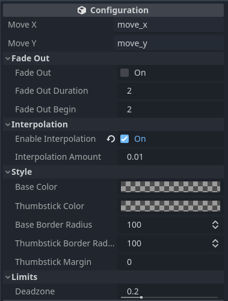
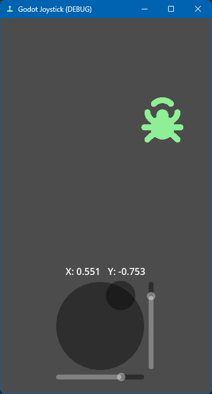

<p align="center">
	
</p>

#A Joystick control for Godot 4.0

> Add the 'Joystick' node to your scene, connect to the signals and you're good to go!

## Installation

Copy the `addons/godot_joystick` folder to the addons folder of your project.

Add the `Joystick` node via `CTRL+A` and add it to your scene.

## Configuration

You can set some settings for your joystick. Take a look at the inspector to see all available settings.



## Usage

In your `\process()` function get the joystick input axes:

```python
func _process(delta) -> void:
	var x : float = Input.get_action_strength("move_x")
	var y : float = Input.get_action_strength("move_y")

	# Use the input axes
	bug.position += Vector2(x,y) * speed * delta
```

## Test scene

The repository contains a test scene under `addons/godot_joystick/Test.tscn`:


