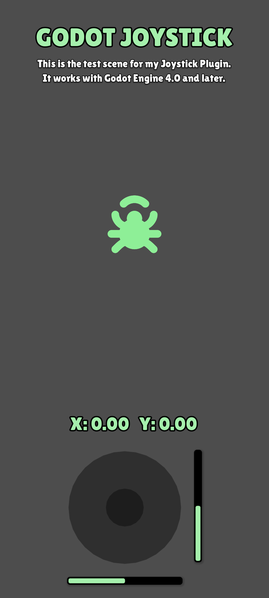

Add the 'Joystick' node to your scene, connect to the signals and you're good to go!

# Live Demo

Test the live demo and features at [https://lucajunge.github.io/godot_joystick/build/index.html](https://lucajunge.github.io/godot_joystick/build/index.html)

# Features

- **Control** your character or something else in your scene
- **Customize** the joystick textures or use no textures at all
- **Configure** the names of the input axes for x and y movement
- **Fade out** the joystick to clear the view to your beautiful scene
- **Adapt** the fadeout duration and begin
- **Interpolate** the thumbstick return, either snapping back or gradually moving back to the center
- **Change the deadzone** to account for small changes in the movement 

# Installation

## Asset Library

The plugin is available in the Asset Library for Godot 4.  
Search for `Joystick` in the Asset Library and click on `Download`. After it finished downloading, click `Install` on the newly opened window.  

Dont forget to enable the plugin in the `Project Settings > Plugins > Joystick > ☑ Enable`.

## Manual Installation

1. Clone the repository

```bash
git clone https://github.com/LucaJunge/godot_joystick.git
```

2. Copy the `addons/joystick` to your `addons` folder in your project.

3. Enable the plugin in the `Project Settings > Plugins > Joystick > ☑ Enable`.

# Usage

## Adding the Joystick to the scene

You can add the  `Joystick` as a new node to your scene.  
An example scene coud look like this:


## Configuration

You can set some settings for your joystick. Take a look at the inspector to see all available settings.


In your `_process()` function get the joystick input axes:

```python
func _process(delta) -> void:
	var x : float = Input.get_action_strength("move_x")
	var y : float = Input.get_action_strength("move_y")

	# Use the input axes
	bug.position += Vector2(x,y) * speed * delta
```

## Test scene

The repository contains a test scene under `addons/godot_joystick/Test.tscn`:


